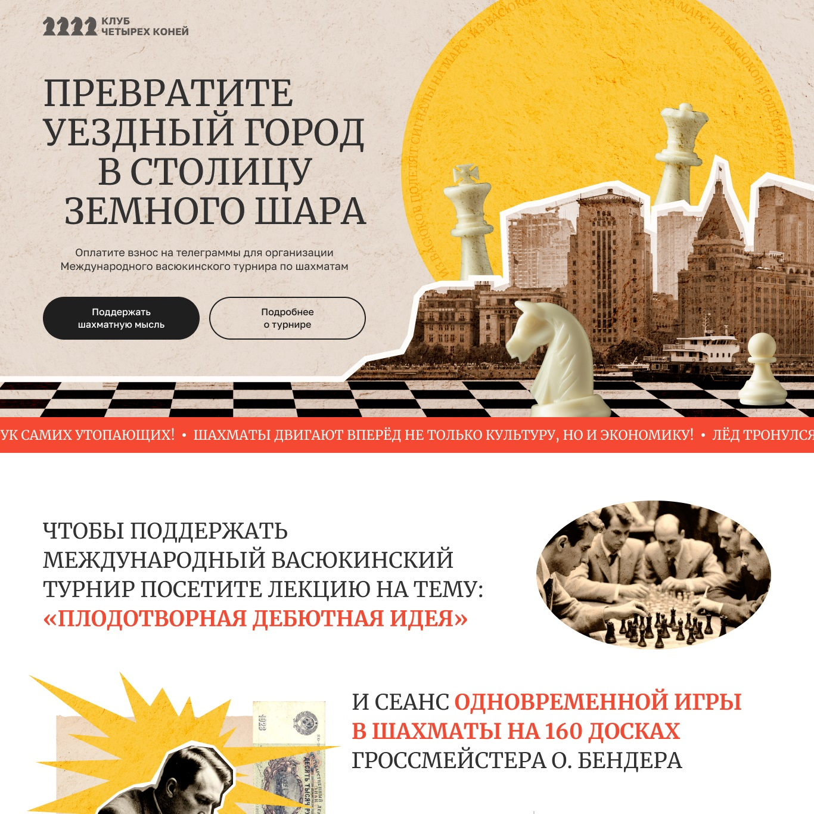

# Test Landing for Yandex

[Показать проект](https://tim2015web.github.io/test_landing_for_yandex/)

[Макет в Figma](https://www.figma.com/file/mbUi7prsyinFITFz5Rmzy8/%D0%94%D0%B8%D0%B7%D0%B0%D0%B9%D0%BD-%D0%B4%D0%BB%D1%8F-%D0%B2%D0%B5%D1%80%D1%81%D1%82%D0%BA%D0%B8-%7C-%D0%A2%D0%B5%D1%81%D1%82%D0%BE%D0%B2%D1%8B%D0%B9-%D0%BB%D0%B5%D0%BD%D0%B4%D0%B8%D0%BD%D0%B3?type=design&node-id=69-1068&mode=design&t=7OOmQFDjnTFNN3Lv-0)

---

## Техническое задание

**Выполните тестовое задание.**
   - Сверстайте адаптивный лендинг по макету в Figma, используя стек `html` + `css` + чистый `js`.
   - Придерживайтесь принципа Pixel Perfect.
   - Избегайте дублирования текстового контента в мобильной и десктопной версиях.
   - Добавьте бегущую строку и другую анимацию по своему усмотрению.
   - Кнопки на стартовом экране являются якорями и ведут к соответствующим блокам.
   - Карусель с карточками участников должна быть зацикленной и меняться автоматически через каждые 4 секунды.
   - Карусель с этапами не должна быть зацикленной и не должна автоматически менять слайды.

---

